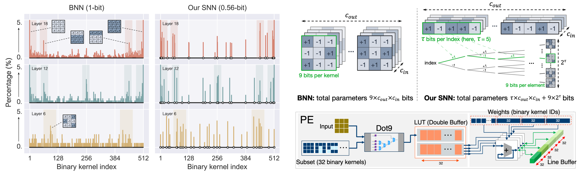

# Sub-bit Neural Networks: Learning to Compress and Accelerate Binary Neural Networks
By Yikai Wang, Yi Yang, Fuchun Sun, Anbang Yao.

This is the pytorch implementation of our paper ["Sub-bit Neural Networks: Learning to Compress and Accelerate Binary Neural Networks"](https://openaccess.thecvf.com/content/ICCV2021/papers/Wang_Sub-Bit_Neural_Networks_Learning_To_Compress_and_Accelerate_Binary_Neural_ICCV_2021_paper.pdf), published in ICCV 2021.

<p align="center"></p>


## Citation

If you find our code useful for your research, please consider citing:

    @inproceedings{wang2021snn,
        title={Sub-bit Neural Networks: Learning to Compress and Accelerate Binary Neural Networks},
        author={Wang, Yikai and Yang, Yi and Sun, Fuchun and Yao, Anbang},
        booktitle={International Conference on Computer Vision (ICCV)},
        year={2021}
    }

## Dataset
Following [this repository](https://github.com/pytorch/examples/tree/master/imagenet#requirements),
- Download the ImageNet dataset from http://www.image-net.org/.
- Then move validation images to labeled subfolders, using [the following script](https://raw.githubusercontent.com/soumith/imagenetloader.torch/master/valprep.sh).

## Requirements:
* python3, pytorch 1.4.0, torchvision 0.5.0

## Training
(1) Step1:  binarizing activations (or you can omit this step by using our Step1 model [`checkpoint_ba.pth.tar`](https://drive.google.com/file/d/1eKIA-XfWjeXdya6Qxgd71yuCXGNBVwds/view?usp=sharing)),
* Change directory to `./step1/`,
* Run the folowing script, 
```
CUDA_VISIBLE_DEVICES=0,1,2,3 python train.py --data=path/to/ILSVRC2012/  --batch_size=512 --learning_rate=1e-3 --epochs=256 --weight_decay=1e-5
```

(2) Step2:  binarizing weights + activations,
* Change directory to `./step2/`,
* Create new folder `./models` and copy `checkpoint_ba.pth.tar` (obtained from Step1) to `./models`,
* Run the folowing script,
```
CUDA_VISIBLE_DEVICES=0,1,2,3 python train.py --data=path/to/ILSVRC2012/  --batch_size=512 --learning_rate=1e-3 --epochs=256 --weight_decay=1e-5 --bit-num=5
```
* Comment: bit-num=5 corresponds to the 0.56 bit, bit-num indicates tau in the paper.

## Results
This implementation is based on ResNet-18 of [ReActNet](https://github.com/liuzechun/ReActNet).
| Bit-Width | Top1-Acc | Top5-Acc | #Params | Bit-OPs | Model & Log |
| --- | --- | --- | --- | --- | --- |
| 1W / 1A | 65.7% | 86.3% | 10.99Mbit | 1.677G | [Google Drive](https://drive.google.com/drive/folders/1TWSIwzGottSGuNPHIs9jHIM7kQ0Ewl_z?usp=sharing) |
| 0.67W / 1A | 63.4% | 84.5% | 7.324Mbit | 0.883G | [Google Drive](https://drive.google.com/drive/folders/1fTmzUaTe_E0J5kLqJI8Qlr1lUNWVcknL?usp=sharing) |
| 0.56W / 1A | 62.1% | 83.8% | 6.103Mbit | 0.501G | [Google Drive](https://drive.google.com/drive/folders/1HiiyxhRsCwf4J0Hx3BrM9oGE_NTAK_Ph?usp=sharing) |
| 0.44W / 1A | 60.7% | 82.7% | 4.882Mbit | 0.297G | [Google Drive](https://drive.google.com/drive/folders/1Q4B3QduAHKjK3JCmf1j7rNi0AQIviMC8?usp=sharing) |

## License

SNN is released under MIT License.
